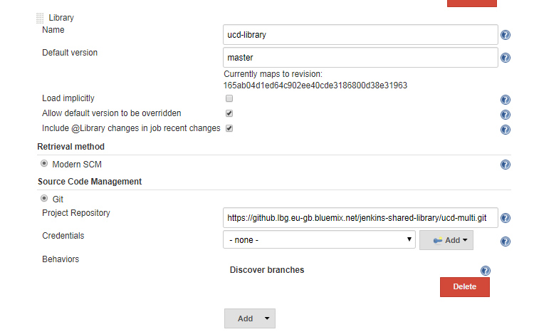

# ucd-multi

Jenkins shared library to facilitate UCD deployment via jenkins using release tracker.

## Dependencies / Pre-requisites

- Eco System
  - Jenkins LTS version is installed and below specified plugins are installed
  - UCD on-boarding should be complete along with UCD service token provisioned for the application
  - UCD Application created and processes defined to be used for deployment
  - Access to UCD from Jenkins servers / slaves
  - Identify nexus server where the artifacts are stored so that can be used for ad-hoc uploads. If credentials are needed should be available in jenkins credential store.
- Jenkins Plugins needed
  - [pipeline utility steps](https://plugins.jenkins.io/pipeline-utility-steps) v2.2.0
- UCD api - v7.0.1
  - [API Reference](https://www.ibm.com/support/knowledgecenter/en/SS4GSP_7.0.1/com.ibm.udeploy.reference.doc/topics/rest_api_ref_overview.html)
  - [CLI Reference](https://www.ibm.com/support/knowledgecenter/en/SS4GSP_7.0.1/com.ibm.udeploy.reference.doc/topics/cli_ch.html)

## Global configuration for Plugins

Below is the configuration of jenkins shared library in global scope when not used with dynamic loading via declarative pipeline

## Features

See the [List of features](docs/features.md) for features available and planned to be implemented as backlog.