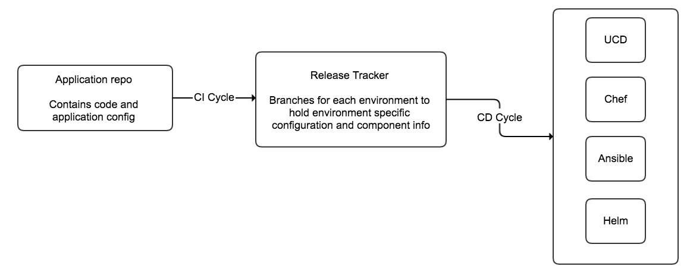

# Release Tracker - High level overview

**"Release tracker"** term consists of below two aspects.

- release tracker as overall orchestrator of deployments
- release tracker as a specific git repository, containing all the release configuration

Release tracker ideally consists of:

release configuration stored in git repository, containing

- list of all components
- list of all properties for all components
- list of all release artifacts with specific version for each component
- additional configuration, like notification email address and a link to confluence page to update after successful release

## UCD pipeline / shared-lib

jenkins jobs based on [ucd pipeline/shared-lib](ucd_pipeline.md), separate for each environment

- dry run job - to verify configuration changes before applying
- properties creation helper - to bulk create new properties in components
- snapshot deployment job - deploys existing snapshot
- snapshot creation and deployment job - applies new properties, creates new snapshot and deploys that
