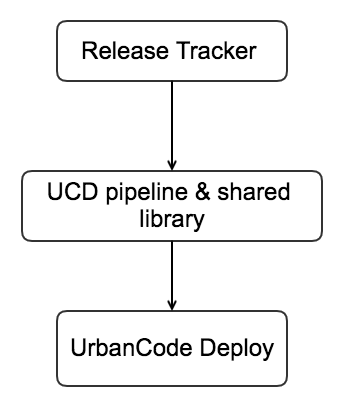
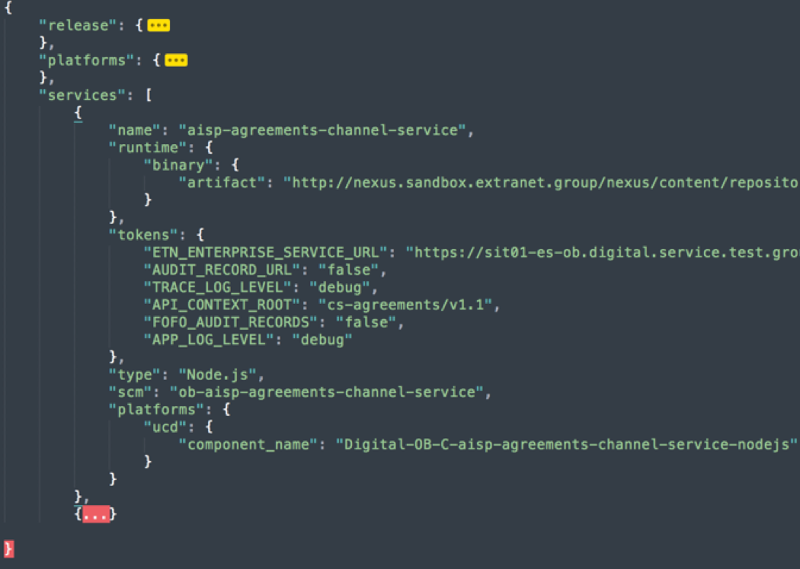
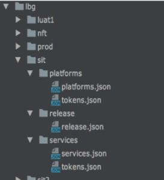

# UCD Pipeline - High level overview

An automated Continuous Delivery solution for deploying applications to UrbanCode Deploy.

The UCD deployment pipeline enables teams to deploy stacks to LBG environments using UrbanCode Deploy. This solution takes propagating configuration changes into account and acts as a Release Tracker, providing a central point of reference and configuration for deployed services to various environments, using UrbanCode Deploy (UCD).

Manual deployments to UCD platform are error-prone and time consuming. By automating the whole deployment process we aim to produce significant productivity gains. We will implement a continuous Delivery solution using Jenkins pipeline-as-code and UrbanCode Deploy.

## Benefits of the pipeline

- Single configuration source
- Single deployment pipeline for LBG environments
- Support UCD configuration and artifact locking

The pipeline is being written using Jenkins pipeline as code, composed into  Shared Libraries which can be consumed from Jenkinsfile. This pipeline supports deployment of node APIs, Java Liberty APIs, node CWA, to on-prem VMs (via UCD).

## Prerequisites for implementation

Below are the pre conditions for using the pipeline:

- Create a release tracker repository in in Git that will hold all the configuration
- Create a Jenkinsfile and use Eagle deployment shared library
- Setup Job on Jenkins that should map to the Jenkinsfile in source repository

## Implementation Guidance

A single repository in the source control system (Git) serves as a ‘deployment & environment tracker.’ aka ‘RELEASE TRACKER’ for the pipeline.  This repository should describes all the environments and each environment should describe release information, micro services, per service definition and environment variables/properties a.k.a. ‘tokens.’

Each environment must define release information, platforms, platform tokens, services and service tokens. They can be defined in two ways in release tracker:

- single json configuration
- directory structure

### single json configuration file

A single json file that contains release information, platform information, platform tokens, services and service tokens. Recommended for a smaller set of services. Makes it easy to visually review changes across release within the same file. 

An example:

### directory structure

Typically recommended where you have a large number of services and environments (projects such as OB)

Platforms

- platforms.json – contains platform specific info for ucd
- tokens.json – platform specific tokens/environment variables

Release

- release.json – contains release information

Services

- services.json – All micro services are defined here,  per service definition including service name, service type and artefact
- tokens.json – service specific environment tokens are defined here

An example:

